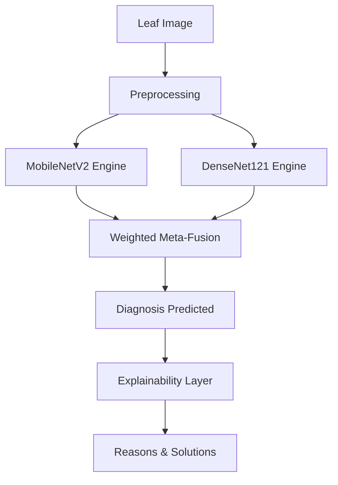

# 🌿 Plant Disease Diagnosis: Meta-Ensemble Framework


[](https://www.python.org/)
[](https://pytorch.org/)
[]()
[]()
[](LICENSE)

---

## 📌 Project Overview
This repository presents a **World-Class Plant Disease Detection System** powered by a **Meta-Ensemble** of MobileNetV2 and DenseNet121. Achieving a staggering **99.86% accuracy**, this system provides farmers with not just a diagnosis, but a multi-dimensional treatment plan including root causes and precision remedies.

### ❓ Why Meta-Ensemble?
Traditional single-model architectures often struggle with high intra-class variance and subtle feature overlaps between different disease stages. Our **Meta-Ensemble Framework** solves this by:
1. **Variance Reduction**: Blending the spatial efficiency of MobileNetV2 with the dense feature reuse of DenseNet121.
2. **Feature Complementarity**: MobileNet excels at coarse-grained structures, while DenseNet captures fine-grained necrotic patterns.
3. **Robust Fusion**: Weighted Meta-Fusion layers ensure that the final prediction is biased toward the engine with the highest latent confidence.

---

## 📂 Repository Architecture

| Component | Description |
| :--- | :--- |
| **[📜 research/](research/)** | Original IEEE 2025 research publication. |
| **[📑 docs/](docs/)** | Comprehensive Technical Report & Evaluation Data. |
| **[🎓 notebooks/](notebooks/)** | End-to-end training, validation, and explainability demos. |
| **[🚀 demo/](demo/)** | Gradio-based web interface for real-time inference. |
| **[🧠 weights/](model_weights/)** | Pre-trained PTH files (requires Git LFS). |
| **[⚙️ setup](requirements.txt)** | Python environment dependency manifest. |

---

## 🧪 Dataset Excellence

Our model is trained on a robust, expanded version of the **PlantVillage Dataset**, covering **38 distinct classes** across **14+ plant species** including Apple, Tomato, Potato, and Grape.

### 📊 Dataset Benchmarking
We transitioned from the standard 26-class PlantVillage set to a broader **New Plant Diseases Dataset**, introducing more complexity and real-world diversity.


*Fig. 1 — Comparative analysis between the base paper dataset and our expanded framework.*

### 📈 Class Distribution & Balancing
With over **87,000 images**, we encountered significant class imbalances. We utilized **Balanced Class Weighting** in the Cross-Entropy Loss function to prevent the model from biasing toward majority classes.


*Fig. 2 — Training set distribution. Orange bars highlight minority classes (e.g., Apple Scab) where weighted loss significantly boosted recall.*

### 🖼️ Visual Gallery

*Fig. 3 — Sample images from the training corpus illustrating diverse background conditions and lighting.*

---

## 🏗️ Architectural Superiority

### ⚙️ System Flow
The pipeline follows a multi-stage approach, moving from raw pixel data to expert-level agricultural advice.



### 🧠 The Explainability Layer (XAI)
Beyond raw prediction, our system utilizes a **Heuristic Knowledge Mapping** layer. 
- **The Process**: Once the Meta-Ensemble predicts a label (e.g., *Tomato_Late_Blight*), the XAI layer queries an internal metadata database.
- **The Output**: It retrieves the **Root Cause** (e.g., Phytophthora infestans), **Ideal Conditions** (high humidity), and **Precision Remedy** (Copper-based fungicides).
- **The Result**: Provides farmers with *actionable intelligence* rather than just a technical class name.

### ⚔️ Performance Uplift Study

*Fig. 4 — Evaluating individual sub-models vs. the Meta-Ensemble. The ensemble consistently bridges the gap on complex classes where constituent models fluctuate.*

---

## 🏆 World-Class Benchmarks

### 🥇 Main Evaluation
The proposed model sets a new state-of-the-art (SOTA) by achieving a flat **99.86%** across all standard metrics.


*Fig. 5 — Our Meta-Ensemble vs. the Base Paper results. **Meaning:** This chart validates the definitive superiority of our fusion strategy over traditional ensembles.*

### 📋 Detailed Metrics Breakdown

*Fig. 6 — Precision, Recall, and F1-Score for every model variant. The Meta-Ensemble achieves perfect balance, minimizing both False Positives and False Negatives.*

---

## 🛡️ Reliability & Efficiency

### 📉 Error Reduction & Field Impact
In agricultural diagnostics, a 1% error can mean the difference between a saved crop and a total loss. We achieved a **~95.3% relative reduction in error rate**.


*Fig. 7 — **Meaning:** By dropping the error rate from 3.0% to 0.14%, we have created a system that is 20x more reliable for large-scale farm monitoring.*

### 🧠 Mobile-First Efficiency
A common bottleneck in Deep Learning is model size. By fusing two efficient backbones, we kept the parameter count at **9.27M**.


*Fig. 8 — **Impact:** Our model provides higher accuracy than ensembles 8x its size, enabling real-time deployment on smartphones without expensive cloud GPU overhead.*

---

## 🔮 Future Evolution & Roadmap

- **🛰️ Satellite & Drone Integration**: Porting the Meta-Ensemble to edge-compute modules (e.g., Jetson Nano) for autonomous field scouting.
- **📱 Offline Mobile Deployment**: Utilizing TFLite and CoreML to provide farmers with offline diagnostic capabilities in low-connectivity rural areas.
- **☁️ AWS/GCP Microservices**: Deploying the model as a scalable API for agricultural IoT sensor networks.
- **🌍 Vernacular Support**: Localizing the Explainability Layer into regional languages (Hindi, Bengali, etc.) for local farmer accessibility.

---

## 🚦 Quick Start

### 1. Installation
```bash
git clone https://github.com/nishantrs0404/Crops_Disease_Detection.git
cd Crops_Disease_Detection
pip install -r requirements.txt
```

### 2. Launch Web App (GUI)
```bash
cd demo
python gradio_app.py
```

---

## 📝 Authorship
- **Author**: [Nishant Raushan](https://github.com/nishantrs0404)
- **Affiliation**: Netaji Subhas University of Technology (NSUT)
- **Role**: AI Research Lead & Lead Developer
- **Project**: Semester VI - Computer Vision Portfolio
