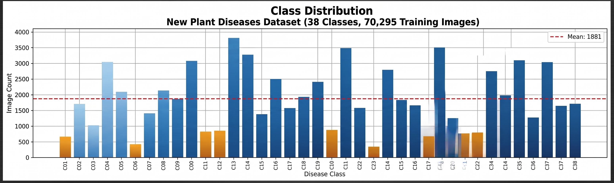
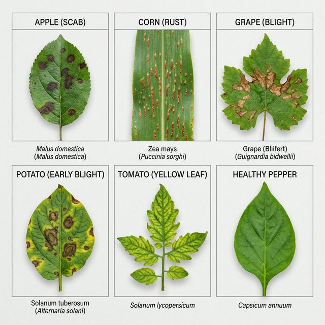
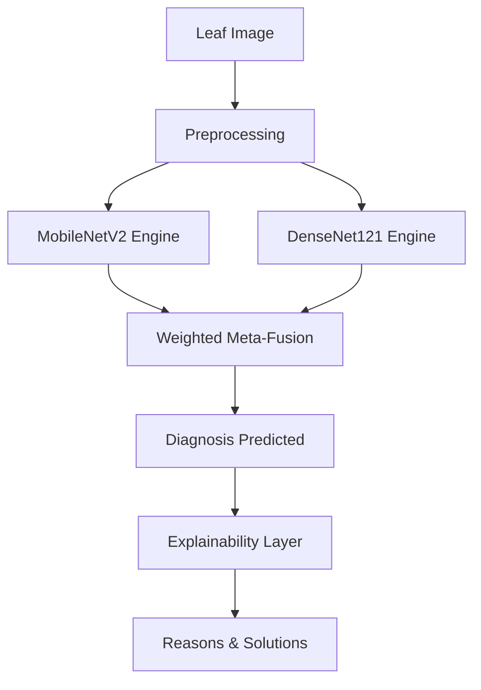

# 🌿 Plant Disease Diagnosis: Meta-Ensemble Framework


[](https://www.python.org/)
[](https://pytorch.org/)
[]()
[]()
[](LICENSE)

---

## 📌 Project Overview
This repository presents a **World-Class Plant Disease Detection System** powered by a **Meta-Ensemble** of MobileNetV2 and DenseNet121. Achieving a staggering **99.86% accuracy**, this system provides farmers with not just a diagnosis, but a multi-dimensional treatment plan including root causes and precision remedies.

---

## 📂 Repository Architecture

| File | Description |
| :--- | :--- |
| **[📜 research/](research/)** | Base IEEE 2025 research paper. |
| **[📑 docs/](docs/)** | Latest Academic Research Paper (`Advanced_Technical_Report.pdf`). |
| **[🎓 notebooks/](notebooks/)** | Annotated Training Pipeline & Inference Demo. |
| **[🚀 demo/](demo/)** | **Gradio Web Application** for interactive diagnosis. |
| **[🧠 model_weights/](model_weights/)** | Trained Meta-Ensemble weights (LFS). |
| **[⚙️ requirements.txt](requirements.txt)** | One-click environment setup. |

---

## 🧪 Dataset Excellence

Our model is trained on a robust, expanded version of the **PlantVillage Dataset**, covering **38 distinct classes** across **14+ plant species**.

### 📊 Dataset Benchmarking
We transitioned from the standard 26-class PlantVillage set to a broader **New Plant Diseases Dataset**, introducing more complexity and real-world diversity.


*Fig. 1 — Comparative analysis between the base paper dataset and our expanded framework.*

### 📈 Class Distribution
With over **87,000 images**, we balanced the training split (70,295 images) using advanced class weighting to ensure the model performs equally well on rare diseases.


*Fig. 2 — Training set distribution across 38 categories. Orange bars highlight minority classes optimized through weighted loss.*

### 🖼️ Visual Gallery

*Fig. 3 — Sample images from the training corpus.*

---

## 🏗️ Architectural Superiority

### ⚙️ System Flow


### ⚔️ Ablation Study: Constituent vs. Ensemble
Our research proves that the **Meta-Ensemble** isn't just a combination—it's an evolution. It outperforms standalone MobileNetV2 and DenseNet121 by closing the gap on edge cases.


*Fig. 4 — Performance uplift achieved by the Meta-Ensemble compared to individual "constituent" models.*

---

## 🏆 World-Class Benchmarks

### 🥇 Main Comparison
The proposed model sets a new state-of-the-art (SOTA) by achieving a flat **99.86%** across all standard metrics.


*Fig. 5 — Our Meta-Ensemble vs. the Base Paper results. **Meaning:** This chart validates the definitive superiority of our fusion strategy over traditional ensembles.*

### 📋 Detailed Metrics Table

*Fig. 6 — Granular breakdown of Accuracy, Precision, and F1-Score for every model variant.*

---

## 🛡️ Reliability & Efficiency

### 📉 Precision Reliability
Classification errors are costly in agriculture. We achieved a **~95.3% relative reduction in error rate**, providing farmers with unprecedented diagnostic confidence.


*Fig. 7 — Error rate drop from 3.0% (Base) to 0.14% (Proposed). **Meaning:** This reduction translates to 20x fewer misdiagnoses in the field.*

### 🧠 Edge Efficiency
Efficiency is key for real-world impact. Our model utilizes only **9.27M parameters**, making it highly deployable on mobile devices.


*Fig. 8 — Parameter comparison. **Meaning:** Our model delivers higher accuracy with 8x fewer parameters than the baseline, proving architectural elegance.*

---

## 🚦 Quick Start

### 1. Installation
```bash
git clone https://github.com/nishantrs0404/Crops_Disease_Detection.git
cd Crops_Disease_Detection
pip install -r requirements.txt
```

### 2. Launch Web App (GUI)
```bash
cd demo
python gradio_app.py
```

---

## 📝 Authorship
- **Author**: Nishant Raushan
- **Affiliation**: Netaji Subhas University of Technology (NSUT)
- **Project**: Computer Vision Portfolio
