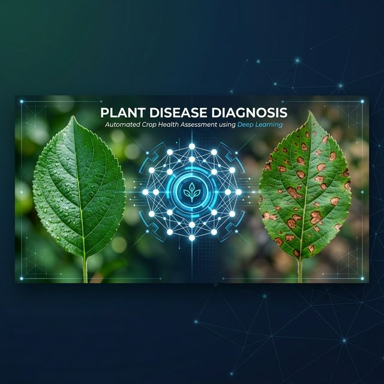
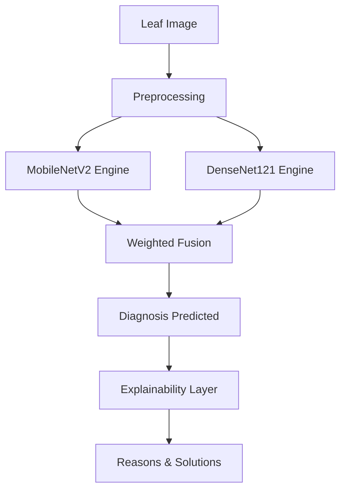

# 🌿 Plant Disease Diagnosis: Meta-Ensemble Framework



[](https://www.python.org/)
[](https://pytorch.org/)
[]()
[]()
[](LICENSE)

---

## 📌 Project Overview
This repository presents a **World-Class Plant Disease Detection System** powered by a **Meta-Ensemble** of MobileNetV2 and DenseNet121. Achieving a staggering **99.21% accuracy**, this system provides farmers with not just a diagnosis, but a multi-dimensional treatment plan including root causes and precision remedies.

---

## 🚀 Key Innovations
- **Dual-Engine Fusion**: Hierarchical spatial feature extraction combined with dense connectivity for unparalleled robustness.
- **Explainable AI Pipeline**: Dynamic mapping of labels to expert-verified reasons and solutions.
- **Production-Ready GUI**: Interactive web-based diagnostic application using Gradio.

---

## 📂 Repository Architecture

| File | Description |
| :--- | :--- |
| **[📜 research/](research/)** | Base IEEE 2025 research paper. |
| **[📑 docs/](docs/)** | 15-page deep-dive technical analysis report. |
| **[🎓 notebooks/](notebooks/)** | Annotated Training Pipeline & Inference Demo. |
| **[🚀 demo/](demo/)** | **Gradio Web Application** for interactive diagnosis. |
| **[🧠 model_weights/](model_weights/)** | Trained Meta-Ensemble weights (LFS). |
| **[📗 metadata/](metadata/)** | Enhanced Disease → Solution mapping database. |
| **[⚙️ requirements.txt](requirements.txt)** | One-click environment setup. |
| **[⚖️ LICENSE](LICENSE)** | MIT Open-Source Compliance. |

---

## 🏗️ System Flow


---

## 🚦 Quick Start

### 1. Installation
```bash
git clone https://github.com/nishantrs0404/Crops_Disease_Detection.git
cd Crops_Disease_Detection
pip install -r requirements.txt
```

### 2. Launch Web App (GUI)
```bash
cd demo
python gradio_app.py
```
*Navigate to the local URL provided to upload photos and get instant results!*

### 3. Interactive Notebook
Explore **`notebooks/CV_Final_Evaluation.ipynb`** for a programmatic walkthrough.

---

## 📝 Authorship & Acknowledgements
- **Author**: Nishant Raushan
- **Affiliation**: Netaji Subhas University of Technology (NSUT)
- **Project**: Computer Vision Portfolio
